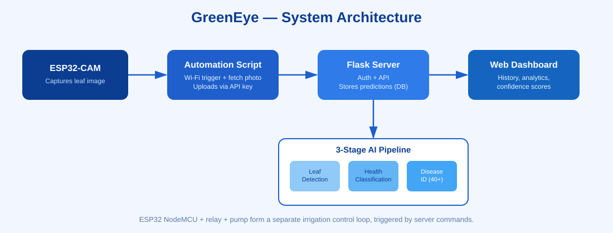
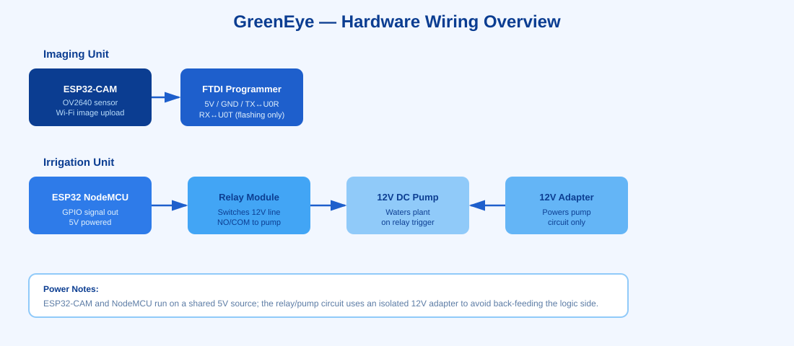

#  GreenEye — AI-Based Plant Disease Detection & Monitoring

**Manual plant disease monitoring is slow, costly, and error-prone.** GreenEye combines low-cost IoT hardware with a deep learning pipeline to give real-time, automated plant health diagnostics — from image capture on the device to a disease classification on a web dashboard.

> **Note:** This project was built as part of a university IoT course. It's a student prototype — some parts of the hardware and pipeline are still rough around the edges and actively being improved. We're sharing it openly so others can learn from it, build on it, or point out what we got wrong. Feedback and PRs are very welcome.

---

**"Technology in the hands of a farmer is not just a tool, it is a new dawn for Agriculture."**

---

##  Objective

- Build an automated IoT-based system for real-time image capture and upload.
- Implement a robust deep learning pipeline that accurately detects and classifies specific plant diseases without human intervention.

---

##  How It Works — Pipeline

1. **Capture** — The ESP32-CAM is powered via a laptop USB port or a portable power bank and positioned to photograph the plant leaf.
2. **Automation script** — A script on the computer connects to the ESP32 over Wi-Fi and triggers it to take a batch of high-resolution photos.
3. **Upload** — The ESP32 sends the captured images back wirelessly; the script securely uploads them to our Flask web server using an API key for authentication.
4. **3-Stage AI Analysis** — The server runs each image through:
   - **Leaf Detection** — confirms the image actually contains a leaf
   - **Health Classification** — Healthy / Dry / Unhealthy
   - **Disease Identification** — specific disease from 40+ categories
5. **Results** — The diagnosis is saved to the database and appears immediately on the user's web dashboard, with health status, disease type, and historical tracking.

---

##  Hardware Components

| Component | Purpose |
|---|---|
| **ESP32-CAM (AI-Thinker, OV2640 sensor)** | Main microcontroller and image sensor — captures leaf photos |
| **ESP32 Programming Board (FTDI/USB adapter)** | Flashes code to the ESP32-CAM and handles serial communication (the CAM board has no onboard USB) |
| **ESP32 NodeMCU** | Controls the water pump through the relay module, enabling automated irrigation based on user commands |
| **Relay Module** | Electrical switch letting the microcontroller drive the high-voltage pump — turns it on/off based on ESP32 signals |
| **9V/12V DC Water Pump** | Supplies water to the plant automatically once the system detects it needs watering |
| **Power Supply** | Laptop USB port or a portable power bank (5V) |

### Wiring Reference

The pump/relay side is wired as: **NodeMCU → Relay (signal + GND) → 12V Pump**, powered from a separate 12V adapter, while the ESP32-CAM is wired to the FTDI programmer for flashing (5V, GND, U0R↔TX, U0T↔RX) and later runs standalone off 5V for image capture.

### Prototype Enclosure

The physical prototype currently lives in a hand-painted cardboard enclosure with a cutout for the camera lens and mounting screw — very much a "course project" build rather than a finished product housing. A 3D-printed or laser-cut enclosure is on the list of future improvements.

---

##  Web Interface

- **Dashboard** — prediction history with thumbnails, health status, and confidence
- **Analytics** — health distribution charts, prediction trends, top diseases detected

---

##  Features

### Authentication
- User registration & login
- Role-based access (regular users vs. administrators)
- Secure session management with proper logout

### Analysis Pipeline
- **Leaf Detection** — is this actually a leaf?
- **Health Classification** — Healthy / Dry / Unhealthy
- **Disease Identification** — 40+ disease categories

### Regular Users
- Upload leaf images for analysis
- View prediction history
- Personal dashboard with confidence scores

### Administrators
- Monitor all user predictions
- Delete inappropriate content
- Comprehensive analytics
- Manage user-generated content

---

##  Technical Stack

**Backend**
- Flask — web framework
- PyTorch — deep learning inference
- PIL/Pillow — image processing
- SQLite/PostgreSQL — database (configurable)

**Frontend**
- HTML5, CSS3, JavaScript, AJAX

**Machine Learning Models**
- MobileNetV3 — leaf detection
- EfficientNet-B0 — health classification & disease detection
- Custom-trained on specialized plant disease datasets

**Reported validation accuracy** (on our training/validation split — not yet stress-tested on wider real-world conditions):
- Leaf Detection: 99.55% (MobileNetV3)
- Health Classification: 99.17% (EfficientNet-B0)
- Disease Identification: 40+ classes

---

##  Known Limitations / Work in Progress

Being upfront, since this is a course project rather than a finished product:
- The hardware enclosure is a rough cardboard prototype, not weatherproof.
- Wi-Fi range and reliability between the ESP32-CAM and the router can be inconsistent.
- The irrigation logic (pump trigger conditions) is still basic and not yet tied directly to soil moisture sensing.
- Model accuracy numbers reflect validation data and may not generalize perfectly to all lighting/background conditions in the field.
- Some parts of the automation script and upload pipeline still need error-handling and retry logic.

We're actively iterating on these — issues and pull requests are welcome.

---

##  Roadmap

**Short-term**
- Mobile application
- Additional plant species support
- Real-time camera analysis
- Multi-language interface

**Long-term**
- Weather integration for disease forecasting
- Treatment recommendation engine
- Community knowledge base
- API for third-party integrations

---

---

##  Authors

Built as a team university IoT course project:

1. [**Robbiul Hasan Jisan**](https://robiulhasanjisan.vercel.app/) 
2. Intesar Hossain 

---

*GreenEye — empowering plant health monitoring through artificial intelligence, making advanced plant disease detection accessible to everyone from home gardeners to commercial farmers.*

**"Healthy plants, sustainable future."**
